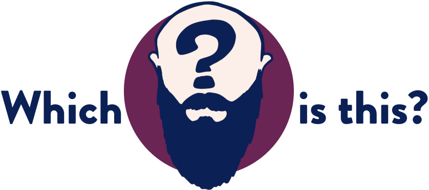

  

<h1 align="center">
  Which beard is this?
</h1>

Is there a bald, bearded man in front of you? Is he talking at length about code? Not sure if it’s Kyle Shevlin or Jason Lengstorf?

**We can help!** Upload an image of this bearded stranger to [whichbeardisthis.com](https://whichbeardisthis.com) and we’ll let you know if you’re looking at [Jason Lengstorf](https://twitter.com/jlengstorf) or [Kyle Shevlin](https://twitter.com/kyleshevlin).

## Wait, what?

This is a site that Jason built with [Gant Laborde](https://twitter.com/gantlaborde) during an episode of [Learn Stuff with Jason](https://www.youtube.com/watch?v=PNEDvkKcXf0&list=PLz8Iz-Fnk_eTpvd49Sa77NiF8Uqq5Iykx&index=2). It uses [face-api.js](https://github.com/justadudewhohacks/face-api.js) to run facial recognition on uploaded images and matches those against reference images of Jason and Kyle.

It’s built using [react-dropzone](https://react-dropzone.js.org/) and [Gatsby](https://gatsbyjs.org).
